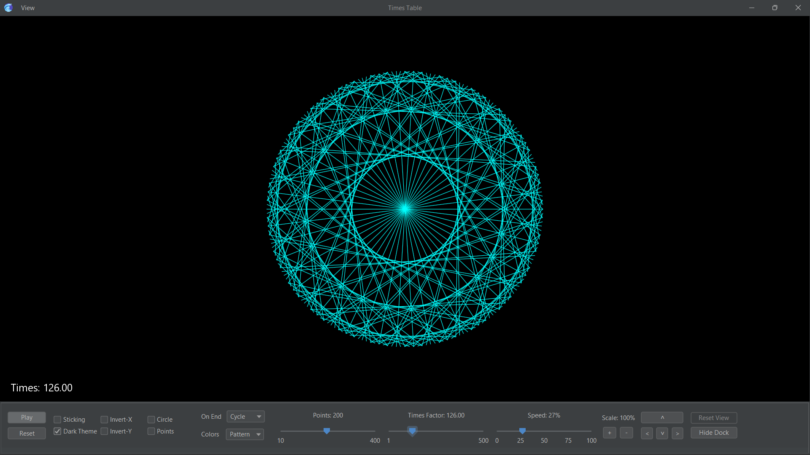

# Times Table simulation

#### A graphical times table modulo arithmetic simulator to demonstrate beautiful mathematical structure embedded within the multiplication tables, and generate curves correlating with the Mandelbrot set. 
#### [View Demo on YouTube](https://youtu.be/P6uKmlRDGvo)

###### See also
[3D N*N Rubik's Cube solver-AI](https://github.com/ChauhanRohan-RC/Cube.git)  
[Fourier Series Simulation](https://github.com/ChauhanRohan-RC/Fourier-Series)  
[3D Chaotic Attractors Simulation](https://github.com/ChauhanRohan-RC/Attractors)

## Overview
* Times Table and the Mandelbrot set are at the heart of mathematics, which encodes the intertwined relationship between numbers, the multiplication and remainder (or modulo) operations
* This simulation allows to generate complex, aww inspiring curves from a simple times table animation. 

* Correlate generated curves with the Generalised Mandelbrot Set
* Some of the commonly known curves and their correlation with mandelbrot set are
  * [Cardioid](https://en.wikipedia.org/wiki/Cardioid) : generated by N x 2 table, correlates with  2nd Mandelbrot set (z2 + e)
  * [Nephroid](https://en.wikipedia.org/wiki/Nephroid) : generated by N x 3 table, correlates with 3rd Mandelbrot set (z3 + e)
  * [Deltoid](https://en.wikipedia.org/wiki/Deltoid_curve) : generated by N X 10 table, correlates with 10th Mandelbrot set (z10 + e)
  * In general, N X j times table correlates with jth Mandelbrot set (zj + e)
* These curves arise in several physical phenomenons in nature such as ray-optics, fractals, sea shores etc

## Features
* Graphical Times Table simulation with fine controls over the algorithm, animation, and user interface
* Algorithm controls
  * `Number of points` (integer)
  * `Times Factor` (integer or float) : animated during the simulation
  * `Sticking` : Pause briefly on an integer times factor to capture Mandelbrot set curve
  * `Draw Circle` : Toggle circle drawing
  * `Draw Points` : Toggle points drawing around the circumference of the circle
* Animation controls
  * `Play/Pause` at any state
  * `Animation Speed` : control the speed of simulation
  * `End behaviour` : Pause, Repeat, Cycle
  * `Reset` : Start over the animation
* Transforms (use mouse gestures / control dock / keyboard)
  * `Invert X` : Invert x-axis
  * `Invert Y` : Invert y-axis
  * `Scale` : Zoom in or out
  * `Translate` : Move the simulation box in coordinate space
  * `Reset` : Invalidate all transforms
* Graphics
  * `Color Scheme`: LINE, PATTERN or NONE
  * `Dark Mode`
  * `Full screen` and `Presentation` modes

## Usage
* Install [Java](https://www.oracle.com/in/java/technologies/downloads/) on your computer and add it to the path
* Clone this repository  
  `git clone https://github.com/ChauhanRohan-RC/Times-Table.git`
* Navigate to `out\artifacts\TimesTable_jar` and run `launch.bat`.  
  Optionally, open up the terminal and run `java -jar TimesTable.jar`

## Connect on
[Twitter](https://twitter.com/0rc_studio)  
[Youtube](https://www.youtube.com/channel/UCmyvutGWtyBRva_jrZfyORA)  
[Google Play Store](https://play.google.com/store/apps/dev?id=7315303590538030232)  
E-mail: com.production.rc@gmail.com

